# App Inventor

App Inventor jest to środowisko do intuicjnego i wizualnego tworzenia aplikacji mobilnych na platformę Android (a w niedługo także iOS) - więcej informacji przeczytasz na stronie projektu - [appinventor.mit.edu](https://appinventor.mit.edu/explore/about-us.html).

## Zadanie - Kalkulator walut NBP

- Zaczynamy od wejścia na stronę AppInventor'a w wersji drugiej oraz zalogowania się kontem google: [ai2.appinventor.mit.edu](http://ai2.appinventor.mit.edu).

- Po zalogowaniu tworzymy nowy projekt i nazywamy go np. `KalkulatorNBP`

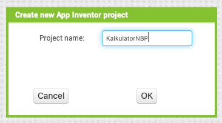

- Z przybornika przeciągamy 
	- `TextBox` na kwotę do przeliczenia
	- `ListView` na listę walut do wyboru
	- `Label` na wynik obliczeń
	- `Web` jako konektor z serwisem NBP - w parametrze Url skonfiguruj adres `http://api.nbp.pl/api/exchangerates/tables/A/?format=json`
	
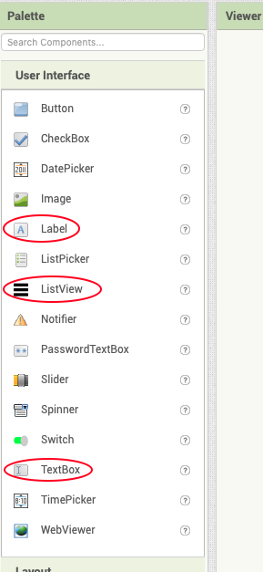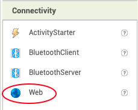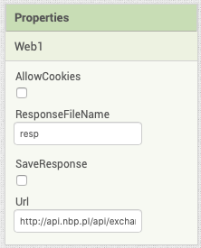	

- Do tego dodaj dodatkowe `Label`'e z nazwami pól oraz ostyluj układ aplikacji wedle własnego uznania. Przykład układu aplikacji jest pokazany na poniższym screen'ie. (Aby układ aplikacji był responsywny używał procentowej szerokości lub opcji pełnego wypełnienia - `Fill parent`)

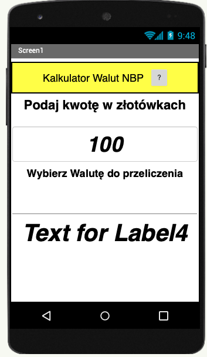

- Zajmijmy się teraz definiowaniem akcji - w tym celu przejdźmy do zakładki `Blocks`

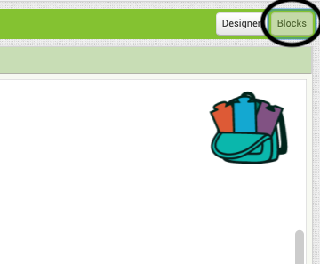

- Na początku zaczynamy od zdefiniowania globalnych zmiennych do przechowywania pobranych kursów walut. 
przeciągnij odpowiednie bloki z przybornika i połącz je w podobny sposób jak na poniższym screenie:

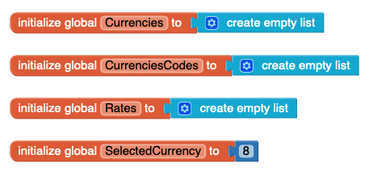

- Następnie przygotujmy procedurę liczącą i wyświetlającą wynik którą później użyjemy kilkukrotnie:

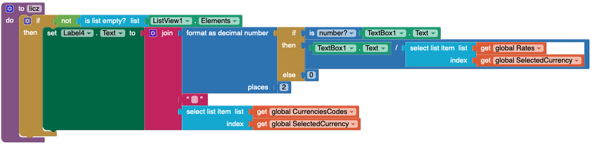

- Teraz ustawmy akcję wykonywaną po wybraniu nowej waluty w `ListView`:

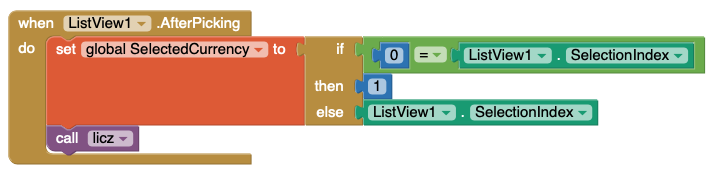

- Ustawmy aby po wyświetleniu aplikacji klient HTTP (`Web`) pobrał dane o aktualnie obowiązujących walutach z serwera NBP:

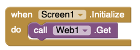

- Teraz należy obsłużyć co ma się stać z pobranymi danymi - przy pomocy odpowiednich funkcji dekodujemy zwróconego JSON'a z NBP API. Przy rozbijaniu JSON'a niestety musimy się posługiwać indeksami a nie kluczami. Pobrane dane wrzucamy do wcześniej przygotowanych zmiennych.

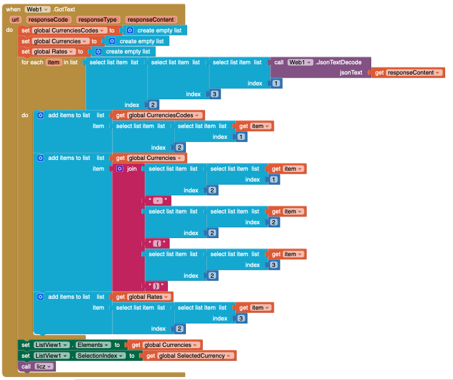

- Do tego możemy jeszcze dodać timer który będzie sam obliczał wynik co pół sekundy (niestety na polu tekstowym nie możemy wywołać akcji po każdej zmianie zawartości - jest możliwość jedynie podłączenia się do zdarzenia `LostFocus`) oraz na przykład drugi widok na którym wyświetlimy informacje na temat NBP lub `WebView` ze stroną *nbp.pl*. Kod blokowy powinien wyglądać podobnie jak na poniższym obrazku:

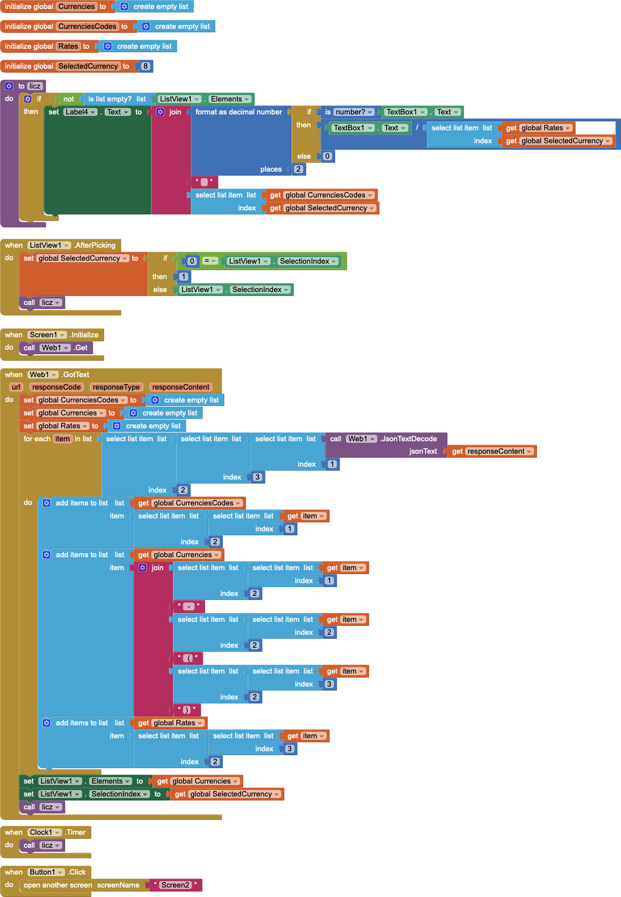

- Teraz możesz spróbować odpalić aplikację na symulatorze (o ile jest zainstalowany na komputerze) lub na swoim telefonie (wymagane łączność komputera z telefonem w ramach jednej sieci)

## Co dalej

- Jeśli chcesz, to możesz rozbudować aplikację aby była możliwość przeliczania walut w obu kierunkach.

## (Nie koniecznie) przydatne Linki

- [Pomocne narzędzie do ustalania indeksów w strukturze JSON](https://community.thunkable.com/t/easy-to-decode-large-information-with-json-format/6132)
- [Kiedy nie ma JSONa...](https://www.youtube.com/watch?v=b4QDxoWlPFw)
- [<Display Name>](<Website URL>)
- [<Display Name>](<Website URL>)
- [<Display Name>](<Website URL>)
- [<Display Name>](<Website URL>)
